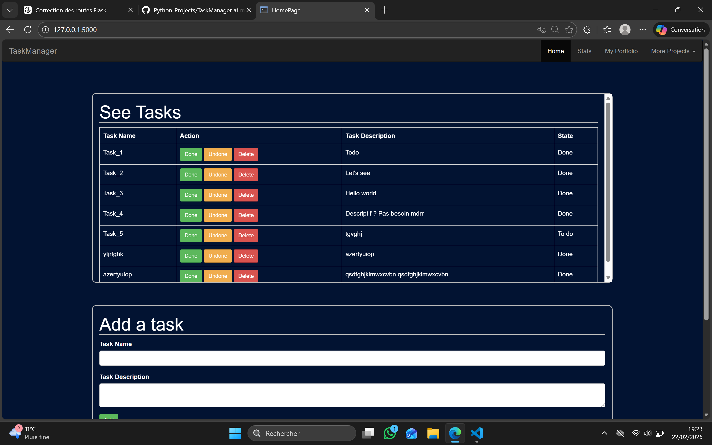
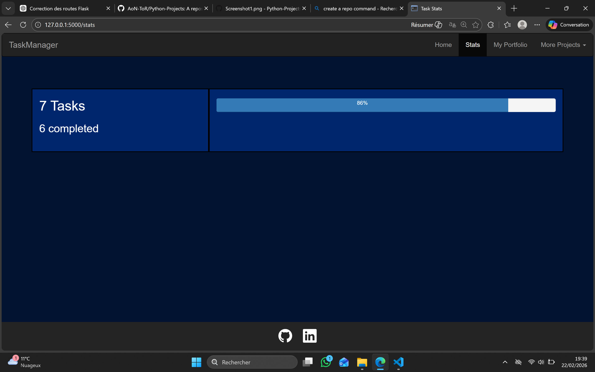

# Task Manager Web

A simple full-stack web application built with Flask that allows users to manage tasks through a clean web interface.

The project focuses on clean architecture, separation of concerns, and practical CRUD operations.

---

## 🚀 Features

- Add, delete tasks
- Mark tasks as done / undone
- Persistent storage using SQLite3
- Statistics dashboard (completed tasks & progress)
- Responsive UI with Bootstrap
- Clean separation between:
  - UI
  - business logic
  - data persistence

---

## 🛠️ Tech Stack

- **Backend**: Python, Flask
- **Frontend**: HTML5, CSS3, Bootstrap, Jinja2
- **Data storage**: Sqlite3
- **Architecture**: Modular (routes / logic / storage)

---

## 🧠 What I Learned

- Building a Flask web application from scratch
- Designing a clean and modular architecture
- Handling form submissions and HTTP methods
- Connecting frontend templates to backend logic
- Managing persistent data within a database
- Using Bootstrap for responsive UI design

---

## ⚡ How to Run
1. Clone the repo:
```
git clone https://github.com/AoN-ToR/Python-Projects.git
cd TaskManager
```
2. Install dependencies:
```
pip install flask
```
3. Run the app
```
python app.py
```
4. Open in browser

## 📸 Screenshots

